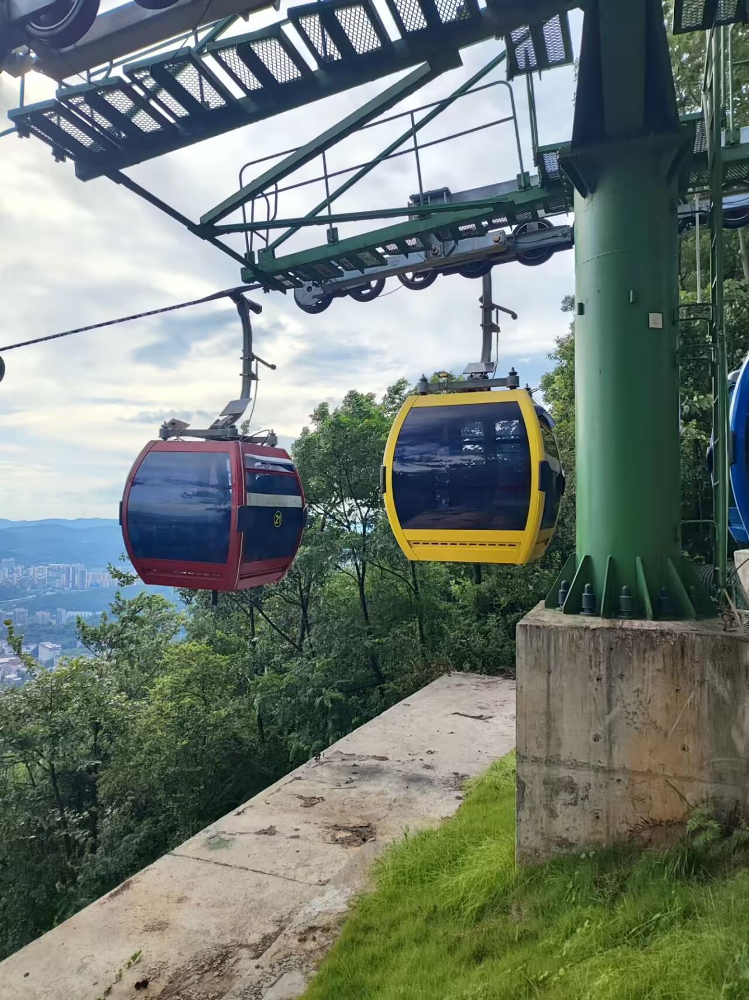

# 缆车-第九十九期

一家人出来爬山，这样的机会可不多，难得看到有缆车，爸爸妈妈和弟弟都没做过缆车，所以我就带他们去体验一下，刚开始他们不太敢看下面，其实距离地面的高度不怎么高，但是他们还是觉得吓人，要抓紧扶手，有能力带他们体验新事物，让我很开心，觉得自己赚钱的意义就莫过于此吧。

## 技术类分享

### x86 模拟器团队发现一段代码糟糕到需要在模拟过程中修复它。

[https://devblogs.microsoft.com/oldnewthing/20260615-00/?p=112419](https://devblogs.microsoft.com/oldnewthing/20260615-00/?p=112419)

微软知名博主 Raymond Chen 在 The Old New Thing 博客讲述了一个趣事：Windows 的 x86 模拟器团队在做 ARM 架构兼容时发现了一段极其糟糕的代码，其写法之差令人发指，以至于团队在模拟层直接将其修复——即在模拟执行时自动替换为正确高效的实现，而非忠实地模拟原始的糟糕逻辑。

### 使用 bash 从没有 curl 的容器发出 HTTP 请求 /dev/tcp

[https://mareksuppa.com/til/bash-dev-tcp-http-without-curl/](https://mareksuppa.com/til/bash-dev-tcp-http-without-curl/)

极简容器镜像通常不包含 curl、wget 或任何 HTTP 客户端工具。作者介绍了一种利用 Bash 内建的/dev/tcp 伪设备进行 HTTP 请求的技巧：通过打开 TCP socket 连接，手写 HTTP/1.1 请求头并发送，就能在没有任何外部工具的情况下完成基本的 HTTP 健康检查和 API 调用。文章给出了具体的脚本示例，适用于 Docker 容器调试、CI 环境探测等场景，是运维和容器化开发中的实用小技巧。

### 独立博客的 Hacker News

[https://bubbles.town/](https://bubbles.town/)

Bubbles 是一个面向独立博客的社区聚合平台，定位为独立博客版的 Hacker News。用户可以提交独立博客文章，社区通过投票机制让优质内容浮上来（bubble up），低质量内容则会消失（pop）。平台支持多种内容分类（科技、文化、写作、音乐等），提供 RSS 订阅和周刊功能，旨在为独立创作者提供一个不依赖算法推荐、由社区驱动的内容发现渠道。

## 非技术分享

### 顶级程序员的天赋与产出

[https://news.ycombinator.com/item?id=48550779](https://news.ycombinator.com/item?id=48550779)

传奇程序员 John Carmack（id Software 创始人、DOOM/Quake 之父）发推盛赞 Fabrice Bellard，称其几乎可以确定是比自己更优秀的全能型程序员。Bellard 是 FFmpeg、QEMU、TCC 等众多开创性项目的作者，以一人之力完成常人难以想象的系统级工程。

很少有人愿意在现有体制内付出努力。在美国，人们喜欢抱怨政治（两党都是如此），但很少有人（包括我！）会花时间去提出解决方案，参加市政厅会议，或者给参议员写信（除了那些让你感觉自己做了点什么的自动回复信息），甚至竞选公职。

### 坐车晕车小技巧

[https://www.theverge.com/tech/942854/apple-vehicle-motion-cues-review-really-work](https://www.theverge.com/tech/942854/apple-vehicle-motion-cues-review-really-work)

难得看到也有人有这样的困惑，晕车导致很多人做不了车，在有些城市行动很受限，可是缓解晕车的方法却一直没什么创新，也没有工具出现， 晕车的本质是"眼睛告诉大脑你没动，耳朵告诉大脑你在动"。解决方案都在让两者统一：要么看窗外让视觉跟上运动，要么用 Apple 那个小圆点在屏幕上模拟运动参照。

### 如何赚到十亿美元

[https://paulgraham.com/earn.html](https://paulgraham.com/earn.html)

初创公司的诞生，以及如何诞生，创造出自己真正需要的产品，然后让人们乐于分享，这样就能实现增长率，从而日积月累达到想要的收入水平。

今年 6 月 10 日，他应牛津大学的学生社团邀请，做了[一次演讲](https://paulgraham.com/earn.html)，题目非常炸裂"如何赚到 10 亿美元"。

我觉得，内容挺有意思，做了一些摘录。

1、

有些人似乎认为，赚到 10 亿美元是不可能的，除非使用非法的、不道德的手段。

在我看来，赚到 10 亿美元确实很困难，但并非不可能，而且机会比大家想象的大。

2、

21 年前的 2005 年，我们创办了孵化器 Y Combinator，至今已经投资了大约 6500 家创业公司。

目前为止，这些公司的创始人之中，大约有 30 人已经成为 10 亿美元级别的富翁。而且，还有更多的人正在快速接近这个目标。

6500 家公司，假定共有 2 万个创始人，其中 30 个人赚到 10 亿美元，机会并不是那么小。

3、

他们赚到 10 亿美元的途径，都是创办一家成功的公司。

4、

最近，我和一位创始人聊天。我问她的公司的增长率，她说上个月是 93%。这意味着，她的净资产很可能也是这个增长率。

我们做一个简单的计算。

假定她的净资产现在是 200 万美元，都投资在她自己的公司。那么公司只要增长 500 倍，她的资产就能达到 10 亿美元级别。

你们觉得，她的公司需要几个月，可以达到 500 倍的增长？

5、

假设公司能够保持每月 93%的增长率，那么只需计算以 1.93 为底数的 500 的对数，即 log(500, 1.93) 。

答案是 9.45。

也就是说，从 200 万美元起步，保持每月 93%的增长率，只需要九个半月就能达到 500 倍增长，从而让你赚到 10 亿美元。

现在你明白了吧，为什么我遇到创始人时，首先要问的就是他们的增长率。

6、

你可能会说，每月 93%的增长率是不现实的。那么，改成每月 15%的增长率，五年以后，你会增长多少倍？

我们计算 1.15 的 60 次方（因为五年是 60 个月）， 1.15^60 的答案大约是 4384。

这意味着五年后，你的公司的收入将是现在的 4384 倍。

如果公司目前的月收入是一万美元，以这样的增长率，五年后的月收入将达到约 4400 万美元，一年就是 5.26 亿美元。届时，如果你像大多数创始人一样持有公司股份，你将成为 10 亿美元富翁。

事实上，15%的月增长率，相当于年增长率不到 5.5 倍。很多创业公司都能达到或超过这个增长速度。

总之，如果你二十岁出头创办了一家公司，保持着高增长率，那么到三十岁时成为 10 亿美元富翁是绝对可能的。

7、

保持高增长率的关键是，你必须创造出足够优秀的产品，让人们口口相传，这样才会有源源不断的顾客。

这也是我总是先询问创始人增长率的另一个原因。增长率能反映出他们是否做出了正确的产品。

8、

任何你真心觉得值得开发的东西，无论听起来多么荒谬，都极有可能发展成一个好的创业点子。

你开发的东西再怎么荒谬，也不可能比我们 2006 年投资的 Justin.TV 更甚。

这家公司只有一个人，就是创始人 Justin Kan。他把摄像头戴在头上，到处走动，直播他经历的一切。

他后来做了一个平台，让其他人也像他这样直播。最终，这家公司发展得相当不错。你可能听说过它，不过现在它叫 Twitch。

9、

创业的关键在于深入了解特定用户群体，从而精准地打造他们真正想要的产品。

用户真正想要的是什么？你能为他们做些什么，从而显著改善他们的生活？

这就是创业的同理心，也是我们在创始人身上寻找和培养的品质。

10、

通过创业赚到 10 亿美元，归根结底有两个决定因素：增长率和增长持续时间。

增长率在于打造用户喜爱并乐于分享的产品；增长持续时间则在于进入一个庞大的市场。

如果你的创业公司能够以指数级速度增长并占领一个庞大的市场，那么它的价值就会飙升，而作为股东的你自然而然就会变得富有，很可能赚到 10 亿美元。
